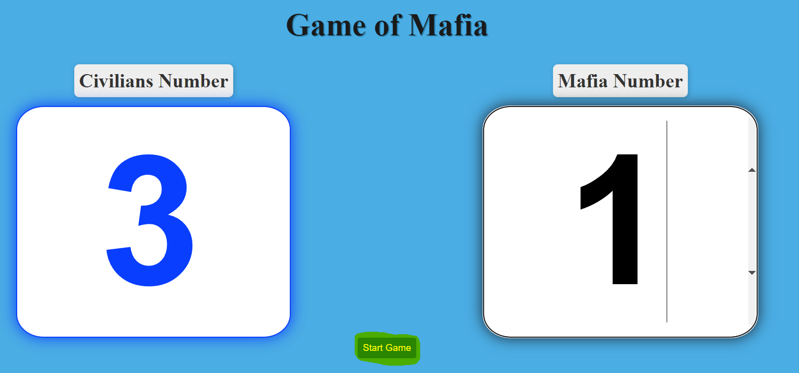
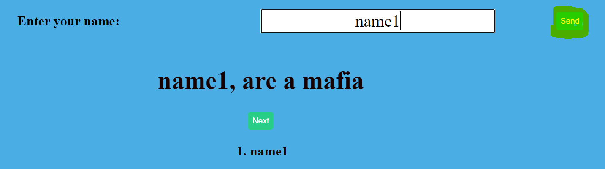
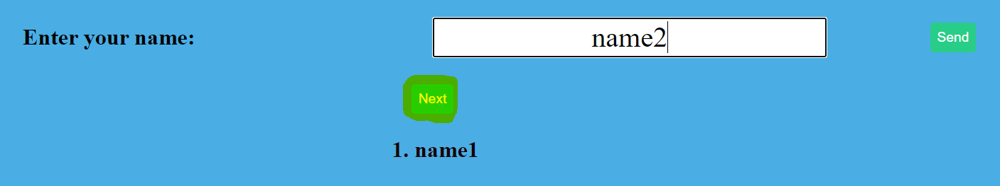
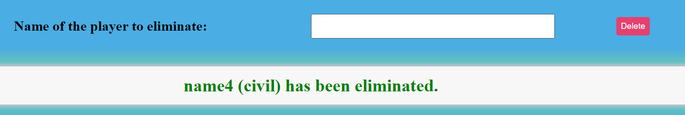
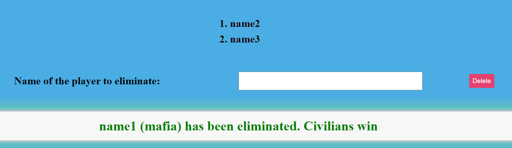

# Mafia Game

The Mafia game is a strategy game in which players are divided into two teams: the civilians and the mobsters. The objective of the civilians is to identify and eliminate the mobsters, while the mobsters try to eliminate the civilians and take control of the game.
First you select the number of civilians and mafia according to the total number of players, then you enter the name of each player to assign a role and so on until all players are assigned their roles of mafia or civilian. 
Once the roles of all players are assigned, the First Round is given a time of debate to decide who are the mafia, among all select a player to eliminate who believe that is the mafia or who has the most votes, the player's name is entered and eliminated, which displays the name of the eliminated player and his assigned role. 
The second round the mafia can eliminate a player (the player eliminated from the first round enters the name of the player to be eliminated chosen by the mafia) and the name of the player eliminated by the mafia and his role is displayed.           
The third round is like the first round and after that starts the fourth round which is like the second round, ie round of civilians to debate and if no one has won follows round of the mafia to eliminate and so on until there is a winner.

</h3>

1. Select the number of villains and mafia, once selected click on the "Start Game" button, this will set the number of mafia and total civilians.
            (look at the following example image) 

2. Enter the name to select a role (the selection of the mafia and civilian roles is random, given the number you selected in step 1) once entered, click on the "Send" button which will display your assigned role. (look at the following example image) 

3. After viewing your role, click the "Next" button to hide your role and the next player can enter their name and assign their role, until the total number of players is reached.(look at the following example image)

4. Select the name of the player to delete .(look at the following example image)

5. Displays the name of the eliminated player and his role(look at the following example image) 

6. The name of the player to be eliminated is selected until a civilian or mafia winner is found.(look at the following example image) 

